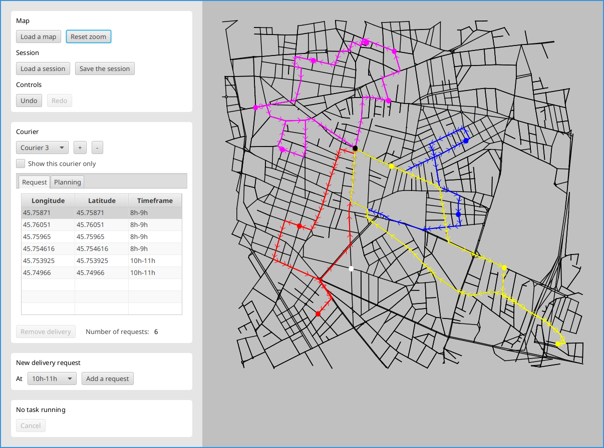

# Route Planner

A Java app to plan delivery routes in a city.

This app was created as a computer science project at INSA Lyon, by a team of 7 students over 2 months, using Agile methodology.

The app lets you load an OpenStreetMap file, add couriers and assign them deliveries at a certain timeframe. The app then asynchronously computes the best route for each courier. This is a variant of the classic [Traveling Salesman Problem](https://en.wikipedia.org/wiki/Travelling_salesman_problem). With a [branch and bound](https://en.wikipedia.org/wiki/Branch_and_bound) algorithm and heuristics, the app can handle up to about 20 deliveries per courier, twice as much as the brute force approach.

### Architecture

One of the goals of the project was to learn about object-oriented software design. It has an MVC architecture and uses JavaFX for the user interface. The code uses several design patterns:

- Observer Pattern to update the views when the model is modified
- State Pattern to handle inputs differently based on the current state
- Command Pattern to let the user undo/redo the actions
- Strategy Pattern to choose the algorithm used for the route computation
- Builder and Factory Pattern to create some objects with low coupling 

## Run the app

### From .jar file

`javac -jar RoutePlanner.jar`

Or simply double-click on Windows.

### From source code

`./gradlew run`

On Windows, replace `gradlew` by `gradlew.bat`

## Development

### Run the tests

`./gradlew test`

### Generate the coverage report

`./gradlew jacocoTestReport`

The report is generated at `build/reports/jacoco/test/html/index.html`

### Generate the documentation

`./gradlew javadoc`

The documentation is generated at `build/docs/javadoc/index.html`

### Generate the jar

`./gradlew shawdowJar`

The jar is at `build/libs/RoutePlanner-1.0-SNAPSHOT-all.jar`
