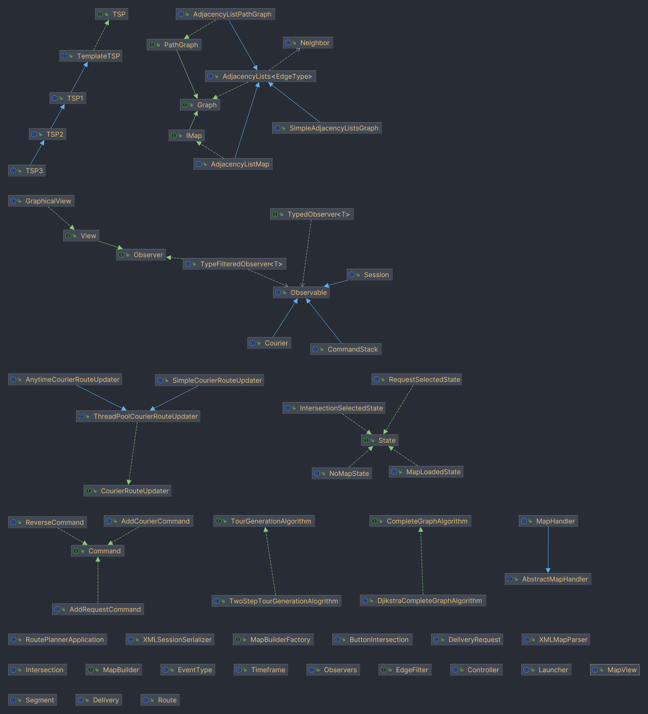
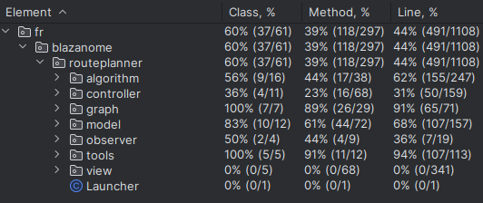
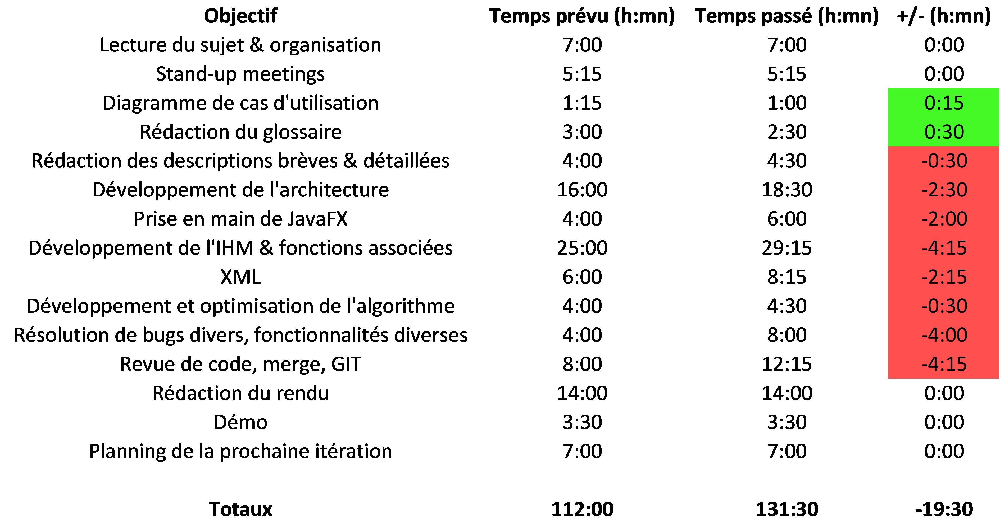
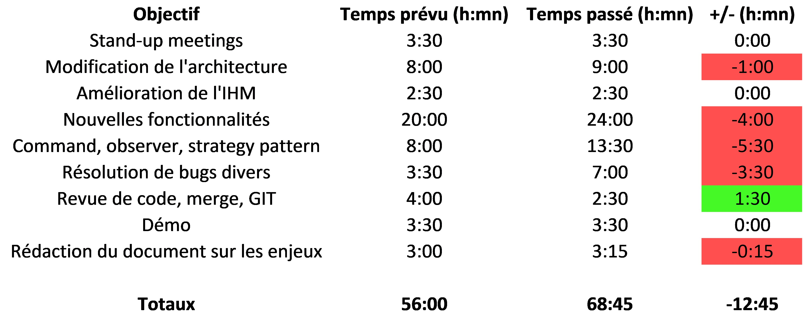
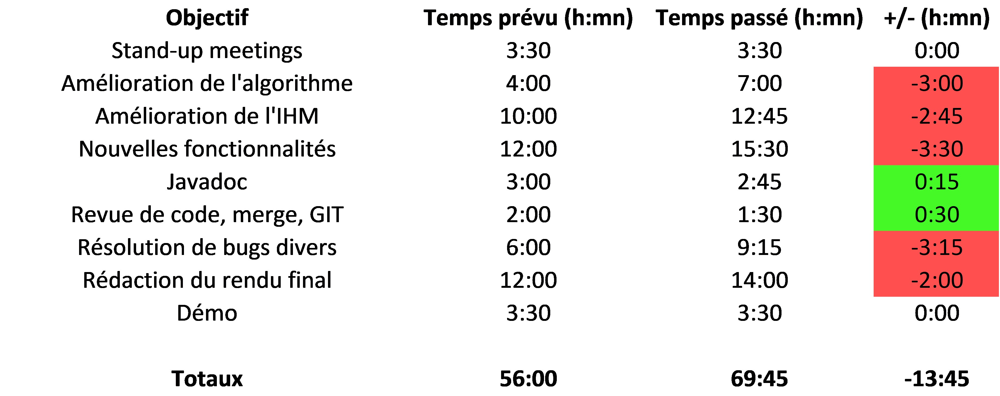

# Choix architecturaux et design patterns utilisés

## Architecture MVC

Notre application graphique s'articule autour d'une architecture *Model, View, Controller*. Le modèle représente les données manipulées qui sont observables par la vue, tandis que le contrôleur réagit aux actions de l'utilisateur pour modifier le modèle ainsi que le comportement de la vue. Pour limiter le couplage, le contrôleur ne connaît pas l'implémentation concrète de la vue, et communique avec des events.

Le modèle est construit comme ceci : 

- `Session` : l'objet rassemblant tout le modèle, qui possède une `Map` et une liste de `Courier`.
- `Map` : la carte, qui possède une liste d'`Intersection` et une liste de `Segment`, qui sont les routes entre les intersections.
- `Courier` : un livreur, qui possède une liste de `DeliveryRequest` et une `Route`.
- `DeliveryRequest` : une demande de livraison à une `Intersection` et pendant une certaine `Timeframe`.
- `Route` : un chemin possédant une liste de `Segment`, qui sont les routes à emprunter pour honorer la liste de `Delivery`.
- `Delivery` : une livraison, qui répond à une `DeliveryRequest` et à laquelle s'ajoute un horaire de passage.

## Observer pattern

La vue est mise à jour en observant les objets du modèle comme `Session` ou encore `Courier`. Ceci est réalisé grâce aux classes `Observable` et `Observer`. De plus, les classes `TypedObserver` et les méthodes helpers de `Observers` ont été ajoutées afin de rendre l'utilisation du pattern plus élégante. On peut par exemple définir un observeur qui n'observe que des `Courier` et sa méthode handler prendra en paramètre un `Courier` au lieu d'un `Observable` qu'il faudrait ensuite convertir.

Enfin, le pattern a été transformé en système d'événements grâce à l'enum `EventType`. Cela était nécessaire afin de gérer les différents cas, et rendre le code de l'observeur plus lisible.

## State pattern

Le contrôleur doit réagir différemment aux actions de la vue en fonction de son état, ce qui se fait avec un state pattern. Par exemple, si on clique sur une intersection, le comportement n'est pas le même si l'intersection était déjà sélectionnée. Le diagramme d'état transition sera détaillé dans une partie spécifique.

## Command pattern

Afin de pouvoir "undo" et "redo" certaines actions, nous avons utilisé le command pattern. Cela s'applique à l'ajout et la suppression de livreurs et de requêtes de livraison. Ces modifications sont encapsulées dans un objet `Command` ajouté au `CommandStack`. On peut ensuite naviguer dans l'historique des commandes avec `apply` and `undo`. Cet historique doit rester linéaire, donc l'ajout d'une commande après plusieurs undo supprime les commandes qui ont été "undo".

## Gestion des graphes

L'implémentation des différents graphes utilisée est découplée des algorithmes à l'aide des interfaces `Graph`, `PathGraph` et `IMap`.

- `Graph` est un graphe simple composé de sommet et d'arêtes
- modèle est construit`PathGraph` hérite de `Graph` et rajoute le concept de graphe parent. Les arêtes d'un `PathGraph` sont des chemins dans son graphe parent.
- `IMap` est un graphe qui permet de stocker et faire des conversions entre des indices de sommet et des `Intersection` et `Sommet`. Elle permet aussi de trouver la warehouse.

Ces 3 formes de graphe sont ensuite implémentées seulement sous forme de listes d'adjacences, mais on pourrait imaginer intégrer d'autres implémentations dans le futur si besoin.

## Création de la Map

Pour découpler le code de chargement XML de l'implémentation de la Map, il a fallu utiliser un builder pattern couplé à un factory pattern : 

- Le `MapBuilderFactory` permet de créer un MapBuilder
- Le `MapBuilder` permet d'enchainer des méthodes de construction avant de récupérer un objet de type `IMap`

Pour chaque implémentation de IMap, on doit donc implémenter ces 2 interfaces afin de pouvoir la construire sans changer le code du parser XML.

## Gestion des algorithmes

Trois types d'algorithmes sont utilisés : 

- `CompleteGraphAlgorithm` représente un algorithme qui génère le graphe complet des plus courts chemins entre un ensemble de sommets dans un autre graphe
- `TSP` résout le problème du voyageur de commerce.
- `TourGenerationAlgorithm` calcule la route et le planning à partir de la carte et d'un `Courier`

`TourGenerationAlgorithm` est implémenté par `TwoStepTourGenerationAlgorithm` qui utilise un `CompleteGraphAlgorithm` et un `TSP`.

## Gestion des threads

Les calculs effectués par les classes mentionnées précédemment ne sont pas exécutés dans le thread principal. Pour gérer la stratégie d'exécution de ces algorithmes, on utilise l'interface `CourierRouteUpdater` qui a pour mission de mettre à jour un `Courier` pour définir sa route en fonction de la requête.

Cette interface est implémentée par la classe abstraite `ThreadPoolCourierRouteUpdater` qui implémente la gestion des différents threads à l'aide d'un `ExecutorService`.

Par-dessus cette classe sont implémentées deux stratégies : 

- `SimpleCourierRouteUpdater` n'update le livreur qu'à la fin des calculs lorsque la meilleure route est trouvée
- `AnytimeCourierRouteUpdater` update le livreur à chaque fois que l'algorithme trouve une meilleure route

Selon la préférence du client après la démonstration, on pourra facilement choisir quel comportement retenir.

## IHM

Nous avons utilisé JavaFX pour l'IHM. L'interface est décrite par un fichier FXML, semblable à du HTML, et stylisé avec un fichier CSS. Au démarache de l'application, JavaFX fait le lien entre le FXML et la classe `GraphicalView`. Ainsi, les boutons appellent des méthodes de cette classe. Nous avons créé un composant custom pour la carte, nommé `MapView`. Pour limiter le couplage, ce composant n'a pas de référence vers la `GraphicalView`, il communique donc de la même façon que les boutons avec des events. Les intersections sont elles-mêmes des composants customs, héritant des boutons.

# Diagramme état-transition

{height=300}

# Diagramme de classes et packages

\newpage

## Différence entre la première itération et le diagramme actuel

### Observer et Observable
Nous avons ajouté la fonctionnalité des `TypedObserver` car nous avons des classes qui observent deux types d'événements très différents, il n'était donc pas cohérent de les traiter à la même place.

### Threads
La recherche de chemins est maintenant déléguée à des threads secondaires afin que la vue continue de répondre aux interactions pendant un calcul de chemin long. Les algorithmes de recherche de chemin sont également passés en anytime afin qu'on affiche un résultat partiel valide à l'utilisateur.

### Command
Le command pattern est maintenant implémenté pour deux types de commandes : `AddCourierCommand` et `AddDeliveryCommand`, ainsi que leurs commandes inverses (créées avec `ReverseCommand`).

### TSP
De nouvelles stratégies sont utilisées pour résoudre le TSP en améliorant la fonction bound : `TSP2` (heuristique naïve) puis `TSP3` (heuristique par MST calculée avec Prim).

### MapBuilder
Ajout d'un builder de `Map` afin de découpler le parse de la map de son implémentation (par liste d'intersection et de segments, ou par liste d'adjacence).

### Modèle
Ajout de classes dans le modèle : `Route`, `Delivery`, `Timeframe`, `Courier` car les timeframes et les multiples livreurs n'étaient pas gérés dans la première itération.

### Vue
Abstraction des interactions entre la vue et le contrôleur : création d'une interface `View`, `FxController` est renommé `GraphicalView`, car malgré son rôle de contrôleur pour JavaFX, son rôle dans notre application s'apparente plus à une vue. `Map` devient `MapView` pour éviter de reprendre des noms déjà définis dans Java.

### Launcher
Une classe launcher est ajoutée pour avoir une classe main qui n'hérite pas d'`Application` (obligatoire pour générer un jar).

# Rapport sur la couverture de test

Le rapport détaillé au format HTML est fourni avec ce rapport, ou peut être généré avec la commande `./gradlew jacocoTestReport`

# Planning

Avec notre fonctionnement de développement AGILE, nous avons travaillé sur Gitea avec des tickets de différentes priorités (faible, moyenne, critique) assignés aux différents membres de l'équipe selon les points forts de chacun. Nous faisions ensuite des "pull requests" qui doivent être relues par les autres membres avant que les changements soient ajoutés à la branche principale. Au total, plus de 70 tickets ont été créés au cours du projet, comprenant les fonctionnalités à implémenter, les bugs à corriger ou les livrables par exemple.

## 1ère itération (du 18/10 au 24/10)

## 2e itération (du 25/10 au 08/11)

## 3e itération (du 09/11 au 13/11)

Comme souvent dans les projets, nous avons grandement sous-estimé le temps nécessaire pour réaliser certaines tâches : par exemple, le développement de l'IHM ou la mise en commun des différents codes sur Git. La dernière séance a été également difficile, car nous avons découvert et corrigé des bugs au dernier moment. Toutefois, notons que nous étions initialement très optimistes en prévoyant de boucler le projet uniquement en séances.

# Réflexion sur les enjeux sociaux et environnementaux

## Introduction

Le développement d'une application comme *RoutePlanner* a un impact certain sur de nombreux enjeux sociaux et environnementaux. Vous trouverez ci-après un début de réflexion sur les 3 problèmes principaux qu'elle implique.

## Des données, énormément de données

Quand on développe une telle application, on peut penser à toutes les données qu'il faut stocker. Par exemple, on voudra sans doute garder l'historique de toutes les livraisons de tous les livreurs enregistrés. Dans l'hypothèse d'une application massivement utilisée, cela représente une quantité importante de données. Le stockage de ces données n'est pas sans coût pour l'environnement puisqu'il nécessite l'utilisation de datacenters, dont la construction et l'utilisation est polluante [1]. En développant *RoutePlanner*, nous participons directement à la création de nouveaux datacenters, contribuant donc à l'épuisement des ressources, à l'augmentation de la consommation d'une électricité majoritairement carbonée [2] et ainsi au changement climatique.

## Une optimisation effrénée, mais pour quoi faire ?

L'optimisation des routes prévue dans *RoutePlanner* requiert le développement d'un algorithme plus ou moins complexe. Dans l'optique d'avoir la meilleure optimisation possible, nous devons coder un algorithme très complexe qui nécessitera plus de puissance de calcul et d'énergie qu'un algorithme plus modeste [3]. Nous pouvons alors questionner cette quête d'optimisation qui émet finalement plus de gaz à effet de serre pour ne gagner parfois que quelques secondes sur le parcours final du livreur. Les clients et les livreurs sont-ils à 10 secondes près ?

## Le livreur : robot ou humain ?

En implémentant un service de livraison, *RoutePlanner* entraîne la machinalisation du travail des livreurs. Chaque livraison étant tracée et minutée, ils sont continuellement sous la pression du temps. Une livraison trop lente, selon les critères de notre algorithme, sera sans aucun doute reprochée au livreur et peut se matérialiser par une baisse de salaire voire un licenciement comme le témoigne Rémy, coursier Uber Eats : "Si on a pas de bons pourcentages, on peut être viré du jour au lendemain" [4]. De plus, dans ce genre de service, la localisation du livreur est souvent partagée au client afin qu'il suive l'avancée de la livraison. Cela pose un sérieux problème de protection de la vie privée du livreur, puisque ces données sensibles pourraient être utilisées à des fins malveillantes.

## Conclusion

Avec un changement climatique incontestable, l'innovation doit s'adapter aux nouveaux enjeux sociaux et environnementaux. Développer des applications doit au moins faire naître une réflexion, au mieux tendre vers une ingénierie frugale et socialement acceptable. Au cours du projet *RoutePlanner*, nous avons pris conscience de ces enjeux.

Nous aurions pu réfléchir sur d'autres sujets comme l'accessibilité ou l'incitation à la surconsommation, mais ces enjeux nous semblaient moins impactés par notre application que les trois précédents.

## Sources

[1] Alizée Colin. Datacenters : quelle part dans la pollution numérique ? [en ligne] 25 avril 2021. Disponible sur : https://lebondigital.com/datacenters-quelle-part-dans-la-pollution-numerique/ (consulté le 23/10/2023)

[2] Malgorzata Wiatros-Motyka. Global Electricity Review 2023. [en ligne] 12 avril 2023. Disponible sur : https://ember-climate.org/insights/research/global-electricity-review-2023/ (consulté le 23/10/2023)

[3] Raphaël Balenieri. Mesurer l'impact environnemental des algorithmes ? Avec CodeCarbon, c'est désormais possible. [en ligne] 2 décembre 2020. Disponible sur : https://www.lesechos.fr/tech-medias/hightech/mesurer-limpact-environnemental-des-algorithmes-avec-codecarbon-cest-desormais-possible-1270217 (consulté le 23/10/2023)

[4] Antoine Marquet. Uber Eats : précarité et surveillance pour les livreurs de repas à domicile. [en ligne] 3 février 2020. Disponible sur : https://france3-regions.francetvinfo.fr/bourgogne-franche-comte/cote-d-or/dijon/uber-eats-precarite-surveillance-livreurs-repas-domicile-1781883.html (consulté le 06/11/2023)

# Critique technique et humaine

Au bout de ce PLD Agile, nous proposons une solution fonctionnelle d'un service de livraison à vélo. Bien que fidèle au cahier des charges du client, elle reste incomplète. Dans le cadre d'un développement réel, et avec plus de temps, nous aurions sans doute pu ajouter d'autres fonctionnalités : 

- avoir une interface plus propre et plus esthétique, avec notamment un fond de carte
- pouvoir choisir parmi plusieurs chemins
- faire correspondre les coordonnées à des adresses (numéros et noms de rues)
- exporter l'itinéraire sur le téléphone du livreur, sur Google Maps par exemple

Sur le plan technique, nous sommes globalement contents de nos choix. Des membres de l'hexanome aurait voulu faire le projet dans un autre langage, mais nous aurions manqué de temps pour l'apprendre et compléter le projet. Le choix de JavaFX pour l'interface était incertain au début puisque personne ne connaissait, mais ça n'a pas été un problème. Le langage semblable à du HTML du framework permet de prototyper rapidement une application sans avoir à écrire trop de code redondant comme avec Swing.

On peut toutefois apporter quelques critiques sur notre architecture. Certains design patterns ont ajouté de la complexité pas toujours utile. Pour le state pattern, il n'est pas facile d'isoler des états complètement indépendants pour cette application. De plus, les boutons de l'interface ont chacun une fonction précise et indépendante de l'état. Nous avons donc au final un nombre limité d'états, et qui partagent beaucoup de code. Le pattern a pour désavantage de rajouter de l'indirection : pour chaque action, il faut écrire la méthode dans le contrôleur, dans l'interface des states, et dans le state concerné. Nous avons aussi eu du mal à bien utiliser l'observer pattern. Souvent, l'observeur manquait d'informations sur ce qui avait changé, et le code de l'observeur devenait assez vite une succession de "if" peu lisible. Nous avons pallié à ça en rajoutant des messages sous forme d'enum pour préciser le type de changement.

Concernant l'équipe, nous avions initialement assigné différents rôles : chef de projet, scrum master, responsable qualité, etc. En avançant dans le projet, nous nous sommes rendu compte que les rôles n'étaient pas exactement respectés, dans la mesure où nous nous organisions plutôt au jour le jour selon les points forts et faiblesses de chacun. Dans un prochain projet, sans doute faudrait-il être un peu plus rigoureux sur l'organisation des tâches, avec des objectifs bien précis par séance et pour chacun. Toutefois, en dehors de ce léger manque d'organisation, la communication entre les membres a été efficace et le travail bien réparti.  Nous avons gardé l'idée des "stands up meeting" au début de chaque séance, qui permettent de rapidement se mettre à jour de l'avancement et de définir les prochains objectifs.
